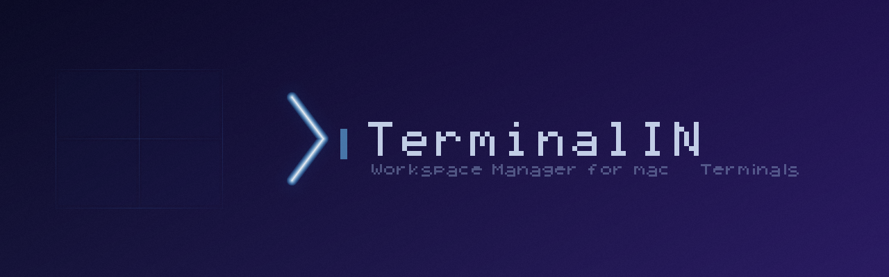
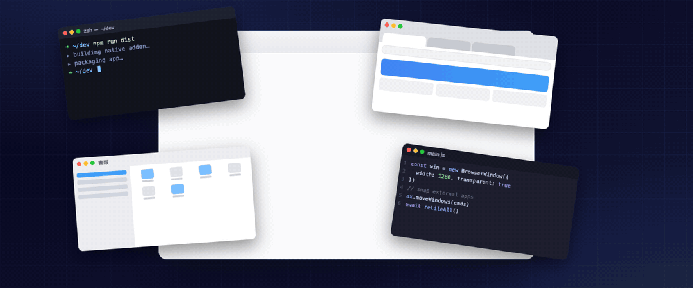
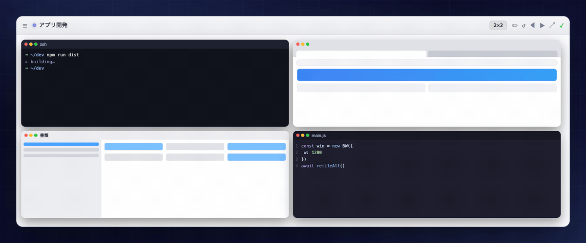
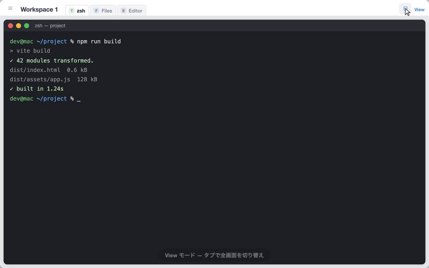
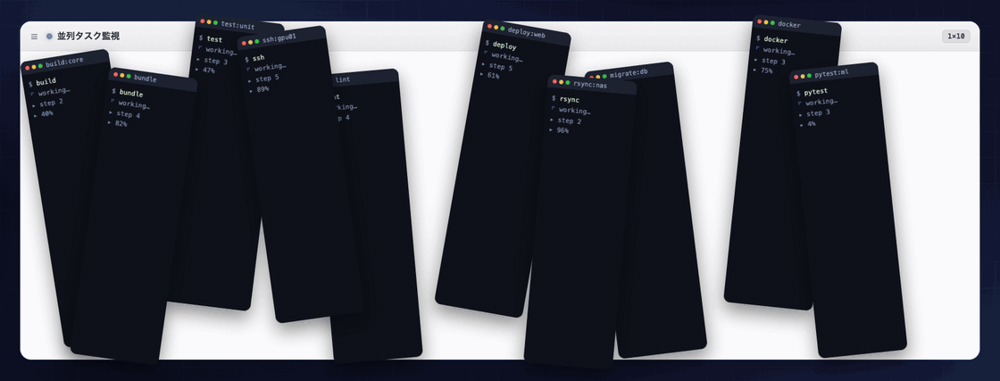

<p align="center">
  
</p>

<p align="center">
  <b>macOS &amp; Windows 向け Groupy スタイルのウィンドウコンテナ。</b><br>
  Terminal・Finder・Word・Excel・Chrome など任意のアプリを 1 つのタブ付きウィンドウにまとめて管理し、デスクトップ間を一体で移動できます。
</p>

<p align="center">
  &nbsp; <b>macOS</b> (Apple Silicon)
  &nbsp;&nbsp;·&nbsp;&nbsp;
  &nbsp; <b>Windows</b> 10 / 11 (x64 · arm64)
</p>

<p align="center">
  <a href="https://github.com/lutelute/TerminalIN/releases/latest"></a>
  
  
  
  <a href="LICENSE"></a>
  <a href="https://github.com/lutelute/TerminalIN/releases"></a>
</p>

<p align="center">
  
</p>

---

## 概要

TiN は「複数のアプリを 1 つのウィンドウに収める」ためのツールです。

- **タブバー** — snapped アプリがタブとして並ぶ。クリックで切り替え
- **グリッド** — 複数アプリを同時に並べて表示（1×2、2×2、カスタムサイズなど）
- **一体移動** — TiN をドラッグするだけで snapped アプリが全部ついてくる（50ms 以内）
- **任意アプリ対応** — Terminal・Finder だけでなく Word・Excel・Chrome・VSCode など macOS の全アプリを Snap 可能
- **デスクトップ追従** — ◀▶ ボタンで TiN と全 snapped アプリをまとめて Space 移動

---

## レイアウト

<p align="center">
  
</p>

幅調整（✏ で分割比率をドラッグ）、ウィンドウのリサイズ（分割比率を維持）、グリッドサイズ変更（2×2 ⇄ 1×4 など）、Retile（↺ で再配置）に対応しています。

## タブで全画面切り替え（View モード）

<p align="center">
  
</p>

⊟ で View モードにすると、snapped した各アプリがタブになり、クリックするだけで全画面表示を瞬時に切り替えられます。グリッド表示 ⇄ タブ表示の切り替えもワンタップです。

## ターミナルの状態表示

<p align="center">
  
</p>

縦長のターミナルを横一列に並べ、状態を色で表示します（実行中 / 完了 / 入力待ち / 要対応）。ヘッダーの集計と合わせて、どれに対応すべきか分かります。

---

## インストール

### 対応プラットフォーム

- **macOS** 15 (Sequoia) 以降 — Apple Silicon / Intel
- **Windows** 10 / 11 — x64 / arm64

### ダウンロード

最新版は [Releases](https://github.com/lutelute/TerminalIN/releases/latest) から。

<table>
<tr>
<td align="center" width="50%">
<a href="https://github.com/lutelute/TerminalIN/releases/latest"></a>
</td>
<td align="center" width="50%">
<a href="https://github.com/lutelute/TerminalIN/releases/latest"></a>
</td>
</tr>
<tr>
<td valign="top">macOS 15 (Sequoia) 以降。<code>*-arm64-mac.zip</code> を解凍して <code>TiN.app</code> を <code>/Applications</code> へ。</td>
<td valign="top">Windows 10 / 11。<code>TiN-Setup-*.exe</code>（インストーラ）または <code>*-win.zip</code>（ポータブル）。</td>
</tr>
</table>

インストール後の補足:

- macOS は初回起動時に Accessibility 権限（システム設定 > プライバシーとセキュリティ > アクセシビリティ）を許可してください。
- Windows は未署名のため、SmartScreen が出たら「詳細情報」→「実行」を選びます。

### 必要環境（ソースからビルドする場合）

- Node.js 20 以上
- macOS: Xcode Command Line Tools（`xcode-select --install`）
- Windows: Visual Studio Build Tools（C++ デスクトップ開発 + 対象アーキテクチャ）

### ソースからビルド & インストール

```bash
git clone https://github.com/lutelute/TerminalIN
cd TerminalIN
npm install
# macOS:
npm run dist             # native addon のビルド + dist/ に TiN.app を生成
bash scripts/install.sh  # /Applications/TiN.app に配置・署名・起動まで自動
# Windows:
npm run dist:win         # native addon + dist/ に NSIS インストーラ(.exe)/zip を生成
```

`install.sh` は以下を自動で行います:
1. 旧 TiN の終了と削除（`rm -rf` — asar の残骸を残さないため）
2. `/Applications/TiN.app` への配置
3. ローカル署名（ad-hoc codesign — Accessibility 権限が再ビルド後も維持されます）
4. 起動

> ビルド済みバイナリは [Releases](https://github.com/lutelute/TerminalIN/releases) から入手できます（macOS は ad-hoc 署名、Windows は未署名）。

### アップデート

```bash
cd TerminalIN
git pull
npm install              # 依存が変わっていなければスキップ可
npm run dist && bash scripts/install.sh
```

snap 状態・ワークスペース設定は `~/Library/Application Support/TiN/` に保存されるため、再インストールしても引き継がれます。

### アンインストール

```bash
osascript -e 'tell application "TiN" to quit'
rm -rf /Applications/TiN.app
rm -rf ~/Library/Application\ Support/TiN   # 設定・ワークスペースも消す場合
```

### 開発モード

```bash
npm run dev              # DevTools 付きで起動
```

---

## 動作確認状況

macOS（作者環境）と Windows 11 arm64（Parallels 実機）では動作を確認しています。それ以外の環境はまだ確認できていないので、動作報告を募集しています。

| 環境 | 状況 |
|------|------|
| Apple Silicon (M1〜M4) + macOS 26 | 確認済み（作者環境） |
| Apple Silicon + macOS 15 (Sequoia) | 未確認 |
| Intel Mac | 未確認（ビルドターゲットが arm64 のみのため `package.json` の調整が必要かも） |
| Windows 11 arm64 | 確認済み（Parallels 実機で起動・内蔵端末・native ロード） |
| Windows 10 / 11 x64 | CI ビルドのみ・実機未確認 |
| Windows の外部ウィンドウ snap | API ロードまで確認 |
| iTerm2 / Warp / Alacritty の snap | 部分的に確認 |
| マルチディスプレイ構成 | 2 枚まで確認 |
| Claude Code 状態検出（hooks） | 作者のワークフローでのみ確認 |

**「動いた」報告だけでも大歓迎です。** [Discussions](https://github.com/lutelute/TerminalIN/discussions) か [Issue](https://github.com/lutelute/TerminalIN/issues) に環境（macOS バージョン・チップ・ディスプレイ構成）を添えて一言ください。

## フィードバック・バグ報告

[GitHub Issues](https://github.com/lutelute/TerminalIN/issues) へお願いします。テンプレートを用意しています。

バグ報告に含めてほしい情報:

- **環境**: macOS バージョン / チップ (Apple Silicon or Intel) / ディスプレイ構成
- **再現手順**: 何をしたらどうなったか
- **ログ**: 開発モード (`npx electron . --dev > /tmp/tin-dev.log 2>&1`) で再現させた場合の `/tmp/tin-dev.log`、または Console.app の TiN のクラッシュログ
- **スクリーンショット**: UI 系の問題は画面があると一気に解決が早くなります

機能要望・アイデアも Issue で歓迎します（`enhancement` ラベル）。

---

## SIP 設定（Space 移動を使う場合）

snapped アプリの Space 間一括移動には yabai Scripting Addition (SA) が必要です。

**Recovery Mode で SIP を部分的に無効化：**

1. Mac を再起動 → 電源ボタン長押し → オプション → ターミナル

```bash
csrutil enable --without debug --without fs
```

2. 通常起動後：

```bash
brew install koekeishiya/formulae/yabai
yabai --start-service
sudo yabai --load-sa
```

> **Apple Silicon (M1〜M4) の注意点**
>
> Darwin 25 (macOS 16) 以降では SA ロードに追加の nvram 設定が必要な場合があります。
> `nvram boot-args="-arm64e_preview_abi"` は Recovery Mode の「低セキュリティ」モードでのみ設定可能です。
>
> SA なしでも TiN 本体の移動・グリッド表示・タブ切り替え・任意アプリの Snap は動作します。
> SA がない場合、Space 移動時に snapped アプリは元のデスクトップに残ります（TiN 本体のみ移動）。

---

## 基本操作

### ヘッダーバー（上部 68px）

```
☰  ワークスペース名  ──────────────────────────  ⊞
                    タブ1  タブ2  タブ3  +   3×2  ✏  ↺  ◀  ▶  ↗  ✓
```

| ボタン | 機能 |
|--------|------|
| **☰** | ドロワーパネルを開く／閉じる |
| **⊞ / ⊡** | グリッドモード ⇔ タブモード 切り替え |
| **タブ** | snapped アプリのタブ。クリックでそのアプリを前面化 |
| **×** | タブの × でそのアプリを unsnap |
| **+** | 新しい組み込み PTY ターミナルを追加 |
| **3×2** | グリッドサイズを変更（クリックでメニュー、スクロールで順送り） |
| **✏** | グリッド分割比率を手動調整（ドラッグで各セルのサイズ変更） |
| **↺** | Retile — 全 snapped アプリを現在の Space に集めてグリッドに再配置 |
| **◀ ▶** | TiN と全 snapped アプリを前／次のデスクトップへ移動 |
| **↗** | デスクトップを選んで移動（ピッカーポップアップ） |
| **✓ / !** | yabai 状態インジケーター（✓ = yabai 起動中、! = 未検出） |

---

## ウィンドウのスナップ

### 手順

1. **☰** をクリックしてドロワーを開く
2. **Terminal / Finder / Apps / TiN** タブから目的のウィンドウを探す
3. **Snap** ボタンをクリック → スロットピッカーが開く
4. 配置したいグリッドのスロットをクリック → TiN のグリッドに配置される

### 対応アプリカテゴリ

| タブ | 対象 |
|------|------|
| **Terminal** | Terminal.app・iTerm2・Alacritty・Warp など |
| **Finder** | Finder のウィンドウ |
| **Apps** | Word・Excel・PowerPoint・Chrome・Firefox・VSCode・Obsidian など macOS の全アプリ |
| **TiN** | 別の TiN ワークスペース |

> アプリが一覧に表示されない場合は、そのアプリのウィンドウが開いているか確認してください。
> 最小化されたウィンドウや別の Space に隠れているウィンドウは表示されないことがあります。

### スナップ中の動作

- snapped ウィンドウは自動的に **sticky（全デスクトップ表示）** になる
- TiN をドラッグすると snapped ウィンドウが **50ms 以内**に追従
- TiN をデスクトップ間移動すると snapped ウィンドウも新しいデスクトップに揃う

### スナップ解除

- タブの **×** ボタンをクリック
- ドロワー GRID セクションの **Release** ボタンをクリック
- 解除されたウィンドウは元の位置・サイズに戻り、sticky も解除される

---

## 表示モード

### グリッドモード（デフォルト ⊞）

複数の snapped アプリを同時に並べて表示します。

- **1×2**: 2 つのウィンドウを上下に並べる
- **2×1**: 2 つのウィンドウを左右に並べる
- **2×2**: 4 つのウィンドウを 2 列 2 行に並べる
- **カスタム**: 最大 20×20 まで自由に指定可能

グリッドサイズは **サイズボタン**（`3×2` 等）のクリックでメニューが開きます。メニュー内のカスタム入力欄に列数・行数を入力するとリアルタイムでプレビューが更新され、OK で確定されます。

### タブモード（⊡）

タブをクリックすると、そのアプリだけが全画面表示され、他のアプリはバックグラウンドに退避します。ブラウザのタブのような感覚で複数アプリを切り替えられます。

**グリッド ⇔ タブ** の切り替えは **⊞ / ⊡** ボタンで行います。

---

## グリッドサイズのカスタマイズ

ヘッダーのサイズボタン（`3×2` 等）をクリックするとポップアップが開きます。

- **プリセット**: 1×2、2×1、1×3、3×1、2×2、2×3、3×2、3×3
- **カスタム入力**: 列数・行数を直接入力（最大 20×20）。入力中にプレビュー SVG がリアルタイム更新
- **スクロール**: サイズボタン上でマウスホイールを回してプリセットを順送り

---

## デスクトップ間の移動

### ボタンで移動（◀ ▶）

TiN ヘッダーの ◀ / ▶ ボタンで、TiN と全 snapped アプリが前後のデスクトップに移動します。

**動作の仕組み（sticky 方式）：**
1. snapped アプリは sticky（全デスクトップ表示）になっている
2. TiN が新しいデスクトップに移動
3. 約 200ms 後に retileAll が走り、アプリが TiN の新位置に揃う

### デスクトップを指定して移動（↗）

↗ ボタンでデスクトップ一覧のポップアップが開きます。目的のデスクトップをクリックすると移動します。

### Mission Control 経由の移動

Mission Control（F3 または Control+↑）で TiN ウィンドウを別のデスクトップにドラッグすると、約 4 秒後のポーリングが変化を検知して retileAll を実行します。

> **yabai SA なしの場合**: TiN 本体のみが移動し、snapped アプリは元のデスクトップに残ります。
> 移動後に ↺（Retile）を押すと snapped アプリが TiN の新位置に揃います。

---

## PTY ターミナル（組み込みターミナル）

TiN はグリッド内に Electron 組み込みの PTY ターミナルを持てます。外部アプリと異なり TiN ウィンドウ内に埋め込まれるため、Space 移動を含む全操作が確実に同期します。

- **+** ボタンで新しい PTY ターミナルを追加
- タブの **×** で削除
- ドロワーの **CONSOLE** セクションで展開して直接操作可能

---

## ドロワーパネル

☰ ボタンで開くドロワーパネルは 2 つのセクションで構成されています。

### GRID セクション

- 現在スナップ済みのウィンドウ一覧（スロット番号・タイトル）
- **Release** ボタンで個別解除
- **Release All** ボタンで一括解除
- スロットドット — ドラッグ & ドロップでスロット順序を入れ替え

### AVAILABLE セクション

- **Terminal / Finder / Apps / TiN** の 4 タブでウィンドウを分類
- 検索ボックスでリアルタイムフィルタ
- **Snap** ボタンをクリック → スロットピッカーで配置先を選択

---

## ワークスペース管理

TiN は複数のワークスペース（TiN ウィンドウ）を持てます。各ワークスペースは独立した snapped アプリのセットを管理します。

- ワークスペース名をクリックして編集（Enter で確定、Escape でキャンセル）
- 再起動後も snap 状態・グリッドサイズ・ウィンドウサイズが自動復元
- ワークスペースごとにアクセントカラーを設定可能

---

## アーキテクチャ

```
TiN.app (Electron)
├── main.js              — メインプロセス
│   ├── workspace 管理・IPC ハンドラ
│   ├── pollFn (4 秒ごとにウィンドウ状態を更新)
│   └── snap / unsnap / retile / Space 移動ロジック
├── workspace.html       — レンダラー (Groupy UI)
│   ├── タブバー（snapped アプリのタブ）
│   ├── ドロワーパネル（Terminal / Finder / Apps / TiN）
│   └── グリッドオーバーレイ（透明・外部アプリが透けて見える）
└── native/ax-helper.mm  — N-API native addon
    ├── AXUIElement 操作（位置・サイズ・raise）
    ├── CGS API（Space 情報・sticky）
    └── CGWindowList（layer==0 の全アプリウィンドウを列挙）
```

**daemon バイナリなし** — AX 操作はすべて TiN 本体プロセス内で実行するため、CDHash 変動による TCC 権限消失問題が発生しません。

---

## 統合プロトコル

外部ツールとの連携用に状態ファイルと URL スキームを公開しています。

**状態ファイル** (`~/Library/Application Support/TiN/`):
- `info.json` — TiN バージョン・capabilities
- `snapped.json` — 現在 snapped 中のウィンドウ一覧（AtelierX 等との連携用）

**URL スキーム:**
```
tin://raise?app=Terminal&windowNumber=145
tin://workspace/focus
tin://terminal/new?cwd=/path/to/dir
```

**ワークスペースメモの Obsidian / Markdown エクスポート:**

各ワークスペースにはドロワーの MEMO セクションでメモ（プロジェクト内容・TODO）を残せます。
メモ + snap 中ウィンドウの一覧は Markdown としてエクスポートできます（要: Orchestration API ON）。

```bash
node scripts/export-memo-obsidian.mjs                      # stdout に出力
node scripts/export-memo-obsidian.mjs ~/Obsidian/TiN.md    # ファイルに日時見出し付きで追記
node scripts/export-memo-obsidian.mjs --daily ~/Obsidian/daily   # daily/YYYY-MM-DD.md に追記
```

cron で定期実行すれば「いつ・どのプロジェクトで・何を開いていたか」の自動作業記録になります。

---

## トラブルシューティング

### Snap ボタンが見つからない

☰ をクリックしてドロワーを開いてください。Terminal・Finder・Apps の各タブにウィンドウが一覧表示されます。

### Apps タブに目的のアプリが表示されない

- アプリのウィンドウが画面上に表示されているか確認してください（最小化・別 Space は検出されません）
- ウィンドウサイズが 50×50px 以下の場合は除外されます

### ウィンドウが Grid に配置されない

- グリッドサイズ（`3×2` 等）の空きスロットがあるか確認
- Retile（↺）ボタンをクリックして強制再配置

### Space 移動で snapped アプリが残る

- ヘッダーの ✓ / ! インジケーターを確認。! の場合は yabai が未検出
- yabai SA が必要な場合は `sudo yabai --load-sa` を実行
- SA なしの場合は移動後に ↺ で手動再配置してください

### グリッドサイズがズレている・スロット数がおかしい

- ↺（Retile）で強制再配置
- TiN を再起動（snap 状態は自動復元されます）

### タブ名が消える・認識がおかしい

- ↺（Retile）で強制同期
- TiN を再起動

### Terminal.app のウィンドウサイズが戻らない

macOS の Terminal.app は AX での拡大方向のリサイズが失敗する既知のバグがあります。unsnap 後に手動でサイズを調整してください。

---

## 支援

TiN は個人が開発している無料・オープンソースのソフトウェアです。開発を応援していただける場合は、以下からサポートできます。

<p align="center">
<a href="https://ko-fi.com/lutelute"></a>
</p>

いただいた支援は、開発時間の確保とコード署名証明書の取得（macOS の公証・Windows の署名で初回起動の警告を消すため）に充てさせていただきます。

---

## ライセンス

[MIT](LICENSE) © lutelute
